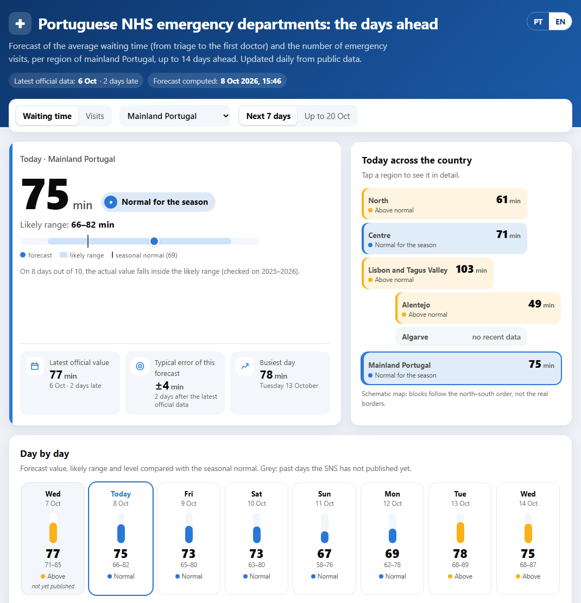
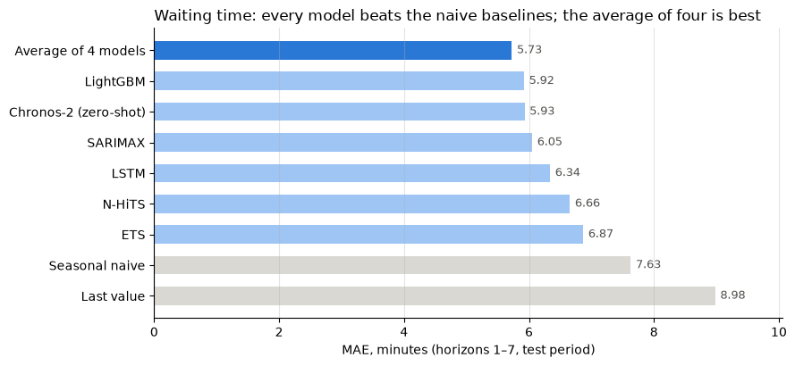
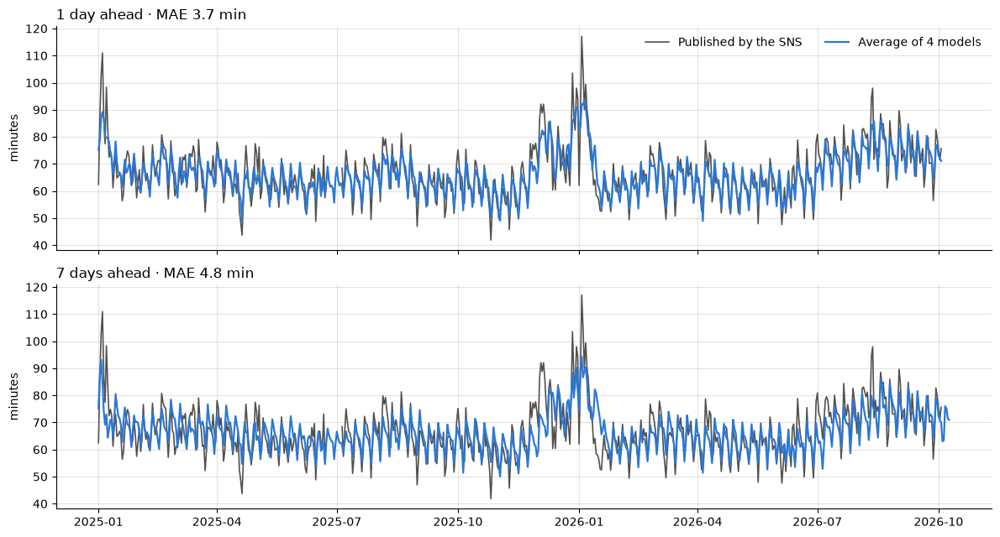

# SNS Emergency Department Forecasting

**How busy will Portuguese public emergency departments be over the next two weeks?**

This project forecasts the **average waiting time** (from triage to the first doctor) and the **number of emergency visits** for every region of mainland Portugal, up to 14 days ahead, with an 80 % likely range. It runs by itself every day on free infrastructure and publishes the result on a public page.

**Live page: [margaridafpereira.github.io/previsao-urgencias-sns](https://margaridafpereira.github.io/previsao-urgencias-sns/)** (Portuguese and English)

[](https://margaridafpereira.github.io/previsao-urgencias-sns/)

## Results

On the test period (2025-01-01 onwards, never used for any choice), the forecast is off by **5.7 minutes on average** for the next week. That is 25 % better than the seasonal naive baseline, against an average wait of about 70 minutes. For visits it is 28 % better.



| Model | Waiting time (min), 1–7 days | 8–14 days | Visits per day, 1–7 days | 8–14 days |
|---|---|---|---|---|
| Seasonal naive (same weekday, latest known week) | 7.63 | 8.76 | 278 | 366 |
| ETS | 6.87 | – | 249 | – |
| N-HiTS (neuralforecast) | 6.66 | – | 249 | – |
| LSTM written from scratch in PyTorch | 6.34 | 6.96 | 226 | 269 |
| SARIMAX with calendar variables | 6.05 | 6.97 | 231 | 310 |
| Chronos-2, zero-shot (never trained on SNS data) | 5.93 | 6.68 | 216 | 282 |
| LightGBM | 5.92 | 6.61 | 219 | 277 |
| **Average of LightGBM, LSTM, SARIMAX and Chronos-2** | **5.73** | **6.40** | **199** | **256** |

Mean absolute error over five series (four regions and mainland Portugal). Horizons count from the latest day published by the SNS. The full analysis is in [notebooks/02-results.ipynb](notebooks/02-results.ipynb).



### What I learnt

1. **A simple model, well fed, beat deep learning.** With about 3,500 days per series, LightGBM with engineered features (lags, flu activity, holidays, the Christmas window) beat an LSTM and N-HiTS. A classical SARIMAX with three calendar variables also beat both networks.
2. **A foundation model matched the best trained model without seeing the data.** Amazon's Chronos-2, used zero-shot with covariates, tied with LightGBM trained on 10 years of SNS data.
3. **Averaging different models was the best choice.** Every combination of two or more models beat the best single model. The final four-model average was chosen on 2023–2024 and confirmed on 2025–2026.
4. **Hyperparameter tuning did not matter; information did.** A 24-configuration search improved LightGBM by 0.01 minutes.
5. **"Real time" is not available from open data.** The SNS publishes with a delay of 2–5 days, in batches. A site that claims real-time waits shows the same delayed regional averages, copied to every hospital. The only honest way to say how today looks is to forecast it, and this page shows the delay openly.
6. **The intervals are honest.** The published value falls inside the 80 % range on 81–85 % of test days, at every horizon.

## How it works

```
08:00 UTC   Daily collection (GitHub Actions)
            SNS Transparency Portal + Open-Meteo weather → data/raw/ (Parquet, versioned)
            + a log of which days the SNS has published, to measure its delay
   ↓
            Daily forecast (GitHub Actions, about 5 minutes on a free CPU runner)
            LightGBM, LSTM and SARIMAX retrained on all data, Chronos-2 zero-shot
            → average of the four, 14 days, 80 % interval → data/predictions/
   ↓
            Public page (GitHub Pages, static, no server)
```

- **Evaluation:** walk-forward, one forecast origin per day, horizons 1–14. Validation on 2023–2024 for every choice, test on 2025 onwards for the final comparison only. Leakage tests check that no feature uses data after the origin.
- **Intervals:** quantile LightGBM at 10 % and 90 %, widened by conformal margins learnt on validation.
- **Regions:** a region is forecast when it has recent data. The Algarve's waiting time is currently not published by the SNS, so it is shown as "no recent data" and returns automatically if publication resumes.
- **Cost:** zero. Public data, open-source models, free GitHub Actions and Pages.

Every decision, with its context and the alternatives rejected, is in the decision log.

## Documentation

| Document | Content |
|---|---|
| [docs/decisions.md](docs/decisions.md) | Decision log (D1–D23): what was decided, why, and what it cost |
| [docs/literature.md](docs/literature.md) | Literature review: models and predictors for ED forecasting, and how this project compares |
| [docs/data-sources.md](docs/data-sources.md) | Data sources, endpoints, fields, data quality, and sources rejected |
| [notebooks/01-eda.ipynb](notebooks/01-eda.ipynb) | Exploratory analysis: gaps, trend, seasonality, flu, temperature, COVID |
| [notebooks/02-results.ipynb](notebooks/02-results.ipynb) | Results: model comparison, error by horizon, forecast vs. actual, interval coverage, error by region |

## Running it

```bash
python -m venv .venv
.venv\Scripts\activate          # Windows (Linux/macOS: source .venv/bin/activate)
pip install -r requirements.txt

python -m src.ingest.sns        # download the SNS datasets into data/raw/
python -m src.ingest.meteo      # download daily weather per region
python -m src.predict           # today's forecast (~5–8 min on a laptop CPU)
python -m src.export_site       # page data in site/data/
python -m http.server 8765 --directory site   # then open http://127.0.0.1:8765/
python -m pytest -q             # run the tests
```

Evaluating the models (each writes its forecasts to `data/forecasts/` and logs to MLflow):

```bash
python -m src.baselines         # naive baselines
python -m src.lgbm              # LightGBM on validation (a few minutes); --test for the test period
python -m src.lstm              # LSTM (~7 min); --test
python -m src.statistical       # ETS and SARIMAX (~20 min); --test
python -m src.chronos2          # Chronos-2 zero-shot (~1 h on CPU); --test
python -m src.nhits             # N-HiTS (~15 min); --test
python -m src.intervals         # 80 % intervals and their calibration margins (~45 min)
python -m src.export_site --accuracy   # error per region for the page
mlflow ui --backend-store-uri sqlite:///mlflow.db   # browse every run (Model training → model-comparison)
```

Run the commands from the repository root.

## Project layout

```
src/ingest/        daily data collection (SNS, Open-Meteo) and the publication log
src/data.py        one daily table per region (date × region)
src/evaluation.py  evaluation protocol shared by every model (D8)
src/features.py    features for LightGBM, one table per horizon
src/baselines.py   naive baselines
src/lgbm.py        LightGBM, one global model per horizon
src/lstm.py        LSTM in PyTorch, all horizons at once
src/statistical.py ETS and SARIMAX (statsmodels)
src/chronos2.py    Chronos-2 foundation model, zero-shot with covariates
src/nhits.py       N-HiTS (neuralforecast)
src/ensemble.py    combinations of saved forecasts
src/intervals.py   80 % intervals: quantile LightGBM + conformal calibration
src/tune_lgbm.py   hyperparameter search, logged to MLflow
src/tracking.py    saves forecasts and logs evaluations to MLflow
src/regions.py     which regions have recent data
src/predict.py     the daily published forecast
src/export_site.py data for the public page
site/              the public page (static HTML, no dependencies)
notebooks/         exploratory analysis and results
data/raw/          downloaded datasets and the publication log (versioned)
data/predictions/  one file per daily forecast (versioned, for future accuracy tracking)
tests/             tests, including leakage tests
.github/workflows/ daily collection, and daily forecast + page publication
```

## Stack (all free)

| Need | Tool |
|---|---|
| Language | Python 3.13 |
| Data | pandas, Parquet, requests |
| Models | LightGBM, PyTorch (LSTM), statsmodels (ETS, SARIMAX), Chronos-2, neuralforecast (N-HiTS) |
| Experiment tracking | MLflow (local SQLite) |
| Automation | GitHub Actions |
| Public page | GitHub Pages, plain HTML/SVG/JavaScript |

## Limitations

- Forecasts are **regional daily averages**, not waits at a given hospital, and not for paediatric, obstetric or psychiatric emergency departments. No open source publishes per-hospital real-time waits.
- The weather forecast for the days ahead is not used yet: the models only see weather up to the latest official day.
- This is an independent project, not affiliated with the SNS. It is not medical advice: in an emergency call 112, and if in doubt call SNS 24 (808 24 24 24).
